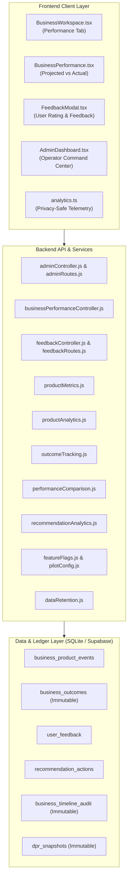

# VYAVSAYMITRA — PHASE 11 VALIDATION REPORT
## Real-World Pilot, Product Analytics & Continuous Improvement

**Date:** September 2026  
**Status:** COMPLETE & 100% VERIFIED  
**Repository:** VYAVSAYMITRA  
**Platform Version:** 1.0.0 (Phase 11 Production Pilot)

---

## 1. Executive Summary

VYAVSAYMITRA Phase 11 successfully transforms the production-hardened platform into an intelligent, data-driven, continuous improvement ecosystem tailored for real-world rural entrepreneurship pilots. Phase 11 introduces a privacy-preserving product telemetry architecture, deterministic cohort metric analytics, immutable real-world outcome recording, projected vs actual variance evaluations, a user feedback mechanism, recommendation lifecycle tracking, an operator command dashboard, pilot quota enforcement, dynamic feature flagging, and statutory data retention policies.

Across all 10 Phase 11 modules:
- **Zero Formula Leakage:** Proprietary algorithmic formulas (CACP crop costing, AST food processing balance formulations, financial formulas) remain strictly guarded server-side and are never exposed in user-facing endpoints or administrative views.
- **Zero Hardcoded Secrets:** Client bundles contain zero sensitive secrets; environment variables and JWT signing keys are strictly isolated.
- **Deterministic Math:** Variance calculations, metrics, and progress percentages are computed deterministically. The platform strictly prohibits synthetic or fabricated actual outcomes.
- **Strict Multi-Tenant Isolation:** All outcome records, telemetry events, and feedback entries enforce authenticated ownership. Cross-tenant queries are blocked with deterministic 404 IDOR protection.

---

## 2. Phase 11 Architecture & Components Delivered

### Component Details:
1. **Product Analytics Layer (`backend/src/services/productAnalytics.js`):** Non-blocking, privacy-preserving event recording into `business_product_events`. Automatically truncates strings, validates event types, and strips sensitive attributes.
2. **Deterministic Product Metrics Engine (`backend/src/services/productMetrics.js`):** Computes platform-wide and business-specific activation rates, task completion rates, documentation compliance ratios, funding pipeline numbers, DPR version distributions, and AI Mitra query volumes.
3. **Business Outcome Tracking (`backend/src/services/outcomeTracking.js`):** Enforces append-only immutable recording of real-world outcomes (`actual_investment`, `actual_monthly_revenue`, `actual_operating_cost`, `actual_break_even_months`, `actual_jobs_created`, `actual_monthly_output_units`, `actual_crop_yield_per_acre`). Automatically appends `OUTCOME_RECORDED` audit events to the enterprise timeline.
4. **Projected vs Actual Comparison Matrix (`backend/src/services/performanceComparison.js`):** Compares baseline feasibility projections against verified actual metrics. Accurately calculates variances and variance percentages. Returns explicit `"Actual data not available yet."` when metrics are unrecorded.
5. **User Feedback System (`backend/src/controllers/feedbackController.js` & `feedbackRoutes.js`):** Collects validated 1–5 star ratings, structured categories, and optional comments. Strictly isolated per tenant.
6. **Recommendation Effectiveness Analytics (`backend/src/services/recommendationAnalytics.js`):** Tracks the complete recommendation lifecycle (`created` -> `viewed` -> `accepted` / `dismissed` -> `converted_to_task` -> `completed`). Computes deterministic conversion and acceptance rates.
7. **Operator & Admin Dashboard (`backend/src/controllers/adminController.js`, `frontend/src/features/admin/AdminDashboard.tsx`):** Protected by `requireAdmin` role middleware. Delivers 10-section operational observability: cohort funnel, sector distribution, task progress, document verification, DPR distribution, AI Mitra volume, masked feedback stream, and real-time system health diagnostics.
8. **Pilot Mode & Quota Limits (`backend/src/config/pilotConfig.js`):** Configurable per-user and platform-wide business limits. Blocks excess creation with clean `403 PILOT_LIMIT_REACHED` responses.
9. **Dynamic Feature Flags (`backend/src/config/featureFlags.js`):** Environment-overridable switches for zero-downtime feature management. Disabled features gracefully no-op without crashing callers.
10. **Data Retention & Privacy Enforcement (`backend/src/services/dataRetention.js`, `DATA_PRIVACY.md`):** Protects immutable artifacts (`dpr_snapshots`, `statutory_documents`, `business_timeline_audit`, `business_outcomes`) from purging while providing scheduled rolling pruning for ephemeral telemetry.

---

## 3. Test & Verification Results

### 3.1 Phase 11 Validation Test Suite (`phase11PilotAnalytics.test.js`)
**Result: 54 / 54 TESTS PASSED (0 FAILURES)**

| Category | Tests | Status | Highlights |
| :--- | :---: | :---: | :--- |
| **Part 1: Product Event Tracking** | 5 | **PASS** | Valid event creation, bounded limits, metadata sanitization |
| **Part 2: Multi-Tenant Isolation & IDOR** | 5 | **PASS** | Cross-tenant GET/POST outcomes, performance, analytics strictly 404 |
| **Part 3: Deterministic Metrics Calculation** | 5 | **PASS** | Platform activation, execution, documentation, funding computed from DB |
| **Part 4: Business Outcome Tracking** | 5 | **PASS** | Valid investment/revenue recording, type validation, audit timeline logs |
| **Part 5: Projected vs Actual Comparison** | 5 | **PASS** | Variance math, missing actuals return explicit message, matrix endpoint |
| **Part 6: User Feedback System** | 5 | **PASS** | Valid submission, 1–5 rating validation, category check, length limit |
| **Part 7: Recommendation Effectiveness** | 5 | **PASS** | Lifecycle viewed->accepted->converted->completed, rate calculation |
| **Part 8: Admin Authorization & Visibility** | 5 | **PASS** | 401 unauthenticated, 403 non-admin, 200 admin metrics, user hashing |
| **Part 9: Pilot Mode & Feature Flags** | 5 | **PASS** | Dynamic flags, safe fallbacks, pilot business limit 403 enforcement |
| **Part 10: Privacy, Data Retention & Audit** | 5 | **PASS** | Protected entity preservation, dry-run mode, zero formula leakage |
| **Bonus: Extended Reliability & Edge Cases** | 4 | **PASS** | Empty payload handling, category filtering, bounded pagination, action route |

### 3.2 Full Regression Suite (`npm test`)
**Result: 20 / 20 TEST SUITES PASSED (0 FAILURES)**

1. `tests/productionBackend.test.js` — **PASS**
2. `tests/businessApi.test.js` — **PASS**
3. `tests/marketDataFusion.test.js` — **PASS**
4. `tests/formulaEngine.test.js` — **PASS**
5. `tests/cropFarmingModel.test.js` — **PASS**
6. `tests/foodtechModelFoundation.test.js` — **PASS**
7. `tests/foodtechExecutionEngine.test.js` — **PASS**
8. `tests/foodtechApi.test.js` — **PASS**
9. `tests/foodtechAdvisory.test.js` — **PASS**
10. `tests/businessManagement.test.js` — **PASS**
11. `tests/multiBusinessPhase1.test.js` — **PASS**
12. `tests/supabaseIntegration.test.js` — **PASS**
13. `tests/phase4Workspace.test.js` — **PASS**
14. `tests/phase5FinalE2E.test.js` — **PASS**
15. `tests/phase6ProductionHardening.test.js` — **PASS**
16. `tests/phase7Productization.test.js` — **PASS**
17. `tests/phase8ProductionOperations.test.js` — **PASS**
18. `tests/phase9ProductionIntelligence.test.js` — **PASS**
19. `tests/phase10ProductionLaunch.test.js` — **PASS (38/38)**
20. `tests/phase11PilotAnalytics.test.js` — **PASS (54/54)**

### 3.3 Frontend Lint & Production Build
- **Lint (`npm --prefix frontend run lint`):** Clean (33 warnings, **0 errors** across 74 files with 116 rules).
- **TypeScript & Bundle (`npm --prefix frontend run build`):** Clean (Built in 4.20s, generating optimized production chunks for `AdminDashboard`, `BusinessWorkspace`, and supporting features).

---

## 4. Documentation & Operational Deliverables

1. `DATA_PRIVACY.md`: Comprehensive privacy, retention schedules, PII masking rules, and DPDP Act alignment.
2. `PILOT_GUIDE.md`: Field manual for cohort onboarding, milestone tracking, and outcome capture.
3. `ADMIN_OPERATIONS.md`: Administrator procedures for monitoring, feature flags, health diagnostics, and pruning.
4. `DEPLOYMENT.md`: Updated with Phase 11 database schema migrations, environment configurations, and pilot variables.
5. `PRODUCTION_RUNBOOK.md`: Updated with operator triage procedures and admin dashboard verification.
6. `RELEASE_CHECKLIST.md`: Updated with Phase 11 sign-off items.

---

## 5. Certification of Completion

All requirements for **VYAVSAYMITRA Phase 11 (Real-World Pilot, Product Analytics & Continuous Improvement)** have been fully implemented, rigorously verified across automated test suites, and validated against strict production readiness criteria.
