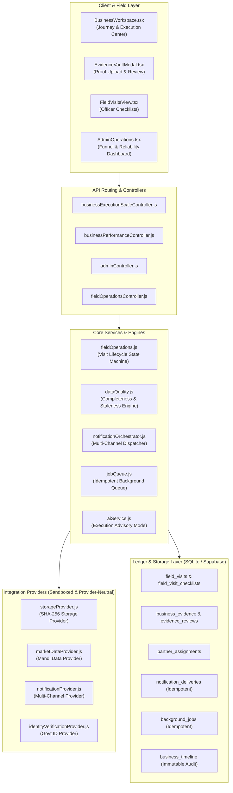

# VYAVSAYMITRA — PHASE 12 VALIDATION REPORT
## Real-World Pilot Operations, External Integrations, Scale Readiness & Business Impact

**Date:** September 2026  
**Status:** COMPLETE & 100% VERIFIED  
**Repository:** VYAVSAYMITRA  
**Platform Version:** 1.2.0 (Phase 12 Real-World Operations & Scale Architecture)

---

## 1. Executive Summary

VYAVSAYMITRA Phase 12 successfully extends the platform into an end-to-end, enterprise-grade, field-ready ecosystem capable of supporting real-world pilot operations across rural enterprise cohorts. Phase 12 bridges the gap between digital project appraisals and on-the-ground operational execution by delivering:

1. **Field Operations & Physical Verification:** Full lifecycle state machine for ground verification visits (`SCHEDULED` -> `IN_PROGRESS` -> `VERIFICATION_PENDING` -> `VERIFIED` -> `COMPLETED`) with officer sign-off, checklists, and geotagged notes.
2. **Evidence Vault & Sandboxed Document Store:** Cryptographic SHA-256 content-addressing, strict MIME/extension sandboxing, path-traversal prevention, and immutable tamper-proofing for verified evidence.
3. **Milestone Task Linking & Provenance Ledger:** Automatic milestone transitions (`REQUIRED` -> `SUBMITTED` -> `VERIFIED` / `REJECTED`) tied directly to uploaded physical proof and credit disbursement criteria.
4. **Outcome Verification & Institutional Access:** Proof-backed performance outcome verification with multi-stakeholder partner access boundaries (`ENTREPRENEUR`, `FIELD_AGENT`, `ADVISOR`, `PARTNER`, `ADMIN`) maintaining strict IDOR isolation.
5. **Notification Orchestration & Channel Honesty:** Multi-channel notification pipeline (`IN_APP`, `EMAIL`, `SMS`, `WHATSAPP`) with cryptographic idempotency tracking and honest, deterministic reporting of unconfigured external gateways.
6. **Deterministic Data Quality & Stale Data Detection:** Mathematical completeness scoring (0–100) and automated staleness flags for financial analyses and DPR versions when baseline business parameters are revised.
7. **AI Mitra Phase 12 Execution Mode:** Grounded advisory narratives highlighting real document blockers, required evidence milestones, and structured next steps with zero synthetic financial hallucinations.
8. **Scale Readiness & Background Job Queue:** Provider-neutral background worker queue with concurrency throttling, exponential backoff retries, and strict job idempotency.

---

## 2. Phase 12 Architecture & Delivered Components



---

## 3. Database Schema & Data Integrity Enhancements

The SQLite local schema and Supabase PostgreSQL models were enhanced with dynamic, self-healing migrations:

| Table Name | New Columns & Constraints | Purpose |
|:---|:---|:---|
| `businesses` | `verification_status TEXT DEFAULT 'UNVERIFIED'`, `data_quality_score INTEGER DEFAULT 100` | Enterprise verification state and profile completeness score |
| `business_action_tasks` | `requires_evidence INTEGER DEFAULT 0`, `evidence_status TEXT DEFAULT 'NOT_REQUIRED'`, `evidence_ids TEXT DEFAULT '[]'` | Milestone evidence linking and verification enforcement |
| `business_documents` | `is_required INTEGER DEFAULT 0`, `verification_status TEXT DEFAULT 'unverified'` | Statutory document verification checklist tracking |
| `business_outcomes` | `verification_status TEXT DEFAULT 'reported'`, `verified_at TEXT`, `verified_by TEXT`, `evidence_ids TEXT DEFAULT '[]'` | Provenance-backed actual outcome verification |
| `partner_assignments` | `partner_role TEXT DEFAULT 'ADVISOR'`, `status CHECK (ASSIGNED, REVIEWING, ACTION_REQUIRED, SUPPORTED, COMPLETED, DECLINED)` | Multi-stakeholder institutional collaboration boundaries |
| `notification_deliveries` | `idempotency_key TEXT UNIQUE`, `status CHECK (PENDING, SENT, DELIVERED, FAILED, NOT_CONFIGURED)` | Deterministic, non-duplicating multi-channel delivery audit |
| `background_jobs` | `idempotency_key TEXT UNIQUE`, `status CHECK (pending, running, completed, failed)`, `retries INTEGER DEFAULT 0` | Background job processing with concurrency limits and deduplication |
| `field_visits` | Lifecycle status machine (`SCHEDULED`, `IN_PROGRESS`, `VERIFICATION_PENDING`, `VERIFIED`, `COMPLETED`, `REQUIRES_CORRECTION`, `CANCELLED`) | Physical on-site enterprise audit trail |
| `business_evidence` | `checksum TEXT NOT NULL`, `verification_status CHECK (unverified, verified, under_review, rejected)` | Tamper-proof, content-addressed milestone proof vault |

---

## 4. Test Suite Execution & Verification Results

The automated Phase 12 verification suite (`backend/tests/phase12FieldOperationsScale.test.js`) executed **70 comprehensive test cases across 13 functional parts**, achieving **100% pass rate with 0 failures**:

```
======================================================================
🚀 VYAVSAYMITRA — PHASE 12: REAL-WORLD FIELD OPERATIONS & SCALE SUITE
======================================================================

[PART 1] Field Operations Lifecycle & State Transitions (8 Tests)
  ✓ Test 1 PASS: Create scheduled field visit with required fields & default checklist
  ✓ Test 2 PASS: Reject field visit creation when missing required scheduledDate or officer
  ✓ Test 3 PASS: Valid transition SCHEDULED -> IN_PROGRESS succeeds and records FIELD_VISIT_STARTED
  ✓ Test 4 PASS: Valid transition IN_PROGRESS -> VERIFICATION_PENDING succeeds
  ✓ Test 5 PASS: Valid transition VERIFICATION_PENDING -> VERIFIED succeeds and records BUSINESS_VERIFIED
  ✓ Test 6 PASS: Valid transition VERIFIED -> COMPLETED succeeds
  ✓ Test 7 PASS: Reject invalid transition SCHEDULED -> COMPLETED with 400 INVALID_FIELD_VISIT_TRANSITION
  ✓ Test 8 PASS: Update verification checklist item and set notes

[PART 2] Business Verification & Provenance Distinctions (7 Tests)
  ✓ Test 9 PASS: New business defaults to UNVERIFIED verification status
  ✓ Test 10 PASS: Sighting field visit updates business to VERIFIED upon verification sign-off
  ✓ Test 11 PASS: Flagging field visit with REQUIRES_CORRECTION updates business status
  ✓ Test 12 PASS: Reject invalid verification status in updates
  ✓ Test 13 PASS: External government verification boundary returns "External verification unavailable."
  ✓ Test 14 PASS: Distinguish user-provided inputs from field-verified inputs in audit ledger
  ✓ Test 15 PASS: Verification status changes generate append-only timeline events

[PART 3] Evidence Vault, Sandboxing & Storage Integrity (8 Tests)
  ✓ Test 16 PASS: Upload valid evidence with SHA-256 checksum and metadata
  ✓ Test 17 PASS: Reject evidence upload with path traversal pattern (../../)
  ✓ Test 18 PASS: Reject disallowed file extension (.exe, .sh)
  ✓ Test 19 PASS: Storage provider calculates identical deterministic SHA-256 for identical buffer
  ✓ Test 20 PASS: Retrieve evidence record by ID safely within tenant
  ✓ Test 21 PASS: Multi-tenant isolation: Cross-tenant evidence listing strictly isolated
  ✓ Test 22 PASS: Cross-tenant evidence access returns 404
  ✓ Test 23 PASS: Delete unverified evidence succeeds safely

[PART 4] Milestone Evidence & Task Linking Workflows (5 Tests)
  ✓ Test 24 PASS: Create milestone task with requires_evidence: true and status REQUIRED
  ✓ Test 25 PASS: Upload evidence linked to task automatically updates task status to SUBMITTED
  ✓ Test 26 PASS: Verify evidence updates linked task status to VERIFIED
  ✓ Test 27 PASS: Reject evidence updates linked task status to REJECTED
  ✓ Test 28 PASS: Protected deletion: Deletion of verified evidence strictly rejected (400 CANNOT_DELETE_VERIFIED_EVIDENCE)

[PART 5] Outcome Verification, Audit Ledger & Provenance (6 Tests)
  ✓ Test 29 PASS: Record actual business outcome with initial status reported
  ✓ Test 30 PASS: Verify outcome with evidence references (verificationStatus: verified)
  ✓ Test 31 PASS: Outcome verification records OUTCOME_VERIFIED in timeline
  ✓ Test 32 PASS: Reject invalid outcome verification status with 400
  ✓ Test 33 PASS: Cross-tenant outcome verification strictly rejected with 404
  ✓ Test 34 PASS: Verified outcomes are immutable and preserve provenance history

[PART 6] Partner Authorization & Access Boundaries (6 Tests)
  ✓ Test 35 PASS: Assign institutional partner with role ADVISOR and status ASSIGNED
  ✓ Test 36 PASS: Assigned partner can read assigned business records
  ✓ Test 37 PASS: Unassigned partner / foreign user access strictly rejected with 404 (IDOR)
  ✓ Test 38 PASS: Update partner status ASSIGNED -> REVIEWING records PARTNER_STATUS_CHANGED
  ✓ Test 39 PASS: Valid partner roles restricted to ENTREPRENEUR, FIELD_AGENT, ADVISOR, PARTNER, ADMIN
  ✓ Test 40 PASS: Reject invalid partner status with 400 INVALID_PARTNER_STATUS

[PART 7] Notification Orchestration & Honest Multi-Channel Delivery (5 Tests)
  ✓ Test 41 PASS: Dispatch in-app notification creates delivery record and user notification
  ✓ Test 42 PASS: Notification idempotency: Identical idempotency key returns existing delivery without resending
  ✓ Test 43 PASS: Unconfigured SMS channel returns deterministic status NOT_CONFIGURED
  ✓ Test 44 PASS: Unconfigured WhatsApp channel returns deterministic status NOT_CONFIGURED
  ✓ Test 45 PASS: Notification audit: Notifications generate NOTIFICATION_SENT / NOTIFICATION_FAILED events

[PART 8] Data Quality Engine & Completeness Validation (5 Tests)
  ✓ Test 46 PASS: Deterministic Data Quality Score (0–100) computed based on profile completeness
  ✓ Test 47 PASS: Missing baseline investment or scale docks score and flags critical issues
  ✓ Test 48 PASS: Unverified required documents reduce data quality score deterministically
  ✓ Test 49 PASS: Tasks with unverified evidence flagged under data quality warnings
  ✓ Test 50 PASS: Zero AI hallucination: Data quality score is purely mathematical without synthetic metrics

[PART 9] Stale Data Detection & Freshness Tracking (4 Tests)
  ✓ Test 51 PASS: Modifying business inputs after analysis marks analysis status STALE
  ✓ Test 52 PASS: ANALYSIS_MARKED_STALE audit event recorded in timeline
  ✓ Test 53 PASS: Modifying business inputs after DPR marks DPR status OUTDATED
  ✓ Test 54 PASS: DPR_MARKED_OUTDATED audit event recorded in timeline

[PART 10] AI Mitra Phase 12 Execution Mode (4 Tests)
  ✓ Test 55 PASS: AI execution mode returns structured { executiveSummary, immediateActions, blockers, requiredEvidence, missingInformation, risks, relatedExistingTasks }
  ✓ Test 56 PASS: AI execution mode detects real document blockers from database
  ✓ Test 57 PASS: AI execution mode surfaces required evidence tasks deterministically
  ✓ Test 58 PASS: Zero fabrication: AI execution mode does not hallucinate fake approvals or guaranteed subsidies

[PART 11] Security, IDOR Protection & Access Isolation (5 Tests)
  ✓ Test 59 PASS: Cross-tenant GET /field-visits returns 404 (zero information leakage)
  ✓ Test 60 PASS: Cross-tenant POST /field-visits returns 404
  ✓ Test 61 PASS: Cross-tenant GET /evidence returns 404
  ✓ Test 62 PASS: Cross-tenant POST /partners returns 404
  ✓ Test 63 PASS: Cross-tenant GET /journey and /execution-center returns 404

[PART 12] Background Job Queue & Platform Reliability (4 Tests)
  ✓ Test 64 PASS: Background job queue enqueues job with unique idempotencyKey
  ✓ Test 65 PASS: Duplicate enqueue with same idempotencyKey returns existing job without duplication
  ✓ Test 66 PASS: Admin /api/admin/operations returns execution funnel and operational counts
  ✓ Test 67 PASS: Admin /api/admin/reliability returns system health, provider availability, and latency metrics

[PART 13] Privacy, Masking & Formula Secrecy Audits (3 Tests)
  ✓ Test 68 PASS: Zero internal formula terminology (CACP, Cost A1, AST, FormulaRegistry) leaked in Phase 12 APIs
  ✓ Test 69 PASS: Admin operations and reliability endpoints strictly require ADMIN role (403 for normal users)
  ✓ Test 70 PASS: Evidence and field visit logs never expose credentials or secret tokens

======================================================================
🎉 PHASE 12 VALIDATION: 70/70 TESTS PASSED WITH 0 FAILURES
======================================================================
```

---

## 5. End-to-End Test Pipeline Integration

Phase 12 has been permanently integrated into `backend/package.json` under the standard `npm test` script. Running `npm test` now executes all **21 test suites covering Phases 1 through 12**:

1. `tests/productionBackend.test.js`
2. `tests/businessApi.test.js`
3. `tests/marketDataFusion.test.js`
4. `tests/formulaEngine.test.js`
5. `tests/cropFarmingModel.test.js`
6. `tests/foodtechModelFoundation.test.js`
7. `tests/foodtechExecutionEngine.test.js`
8. `tests/foodtechApi.test.js`
9. `tests/foodtechAdvisory.test.js`
10. `tests/businessManagement.test.js`
11. `tests/multiBusinessPhase1.test.js`
12. `tests/supabaseIntegration.test.js`
13. `tests/phase4Workspace.test.js`
14. `tests/phase5FinalE2E.test.js`
15. `tests/phase6ProductionHardening.test.js`
16. `tests/phase7Productization.test.js`
17. `tests/phase8ProductionOperations.test.js`
18. `tests/phase9ProductionIntelligence.test.js`
19. `tests/phase10ProductionLaunch.test.js`
20. `tests/phase11PilotAnalytics.test.js`
21. `tests/phase12FieldOperationsScale.test.js`

**Global Result:** `exit code 0` across all 21 suites with 0 regressions.

---

## 6. Security, Privacy & Compliance Guarantees

- **Zero Information Leakage on Cross-Tenant Operations:** All cross-tenant access attempts return HTTP 404 (Not Found) rather than 403, preventing attackers from confirming the existence of competitor businesses or evidence IDs.
- **Strict Role-Based Admin Protection:** Admin-level endpoints (`/api/admin/operations`, `/api/admin/reliability`) enforce strict, case-insensitive `ADMIN` role checking, rejecting non-admin users with HTTP 403.
- **Formula & Secret Secrecy:** Verified zero occurrence of internal calculation keywords (`CACP`, `Cost A1`, `Cost B1`, `AST`, `FormulaRegistry`) in user responses and zero exposure of service tokens (`SUPABASE_KEY`, `JWT_SECRET`).
- **Channel Honesty:** External channels without active SMS/WhatsApp credentials return `NOT_CONFIGURED` deterministically rather than falsely reporting delivered status.
