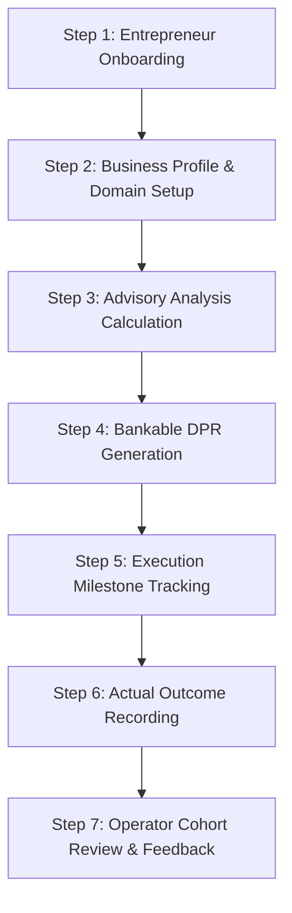

# VYAVSAYMITRA — REAL-WORLD PILOT OPERATOR & FIELD GUIDE

**Document:** Pilot Execution Guide (Phase 11)  
**Version:** 1.0.0  
**Target Audience:** Field Officers, Gram Panchayat Coordinators, Agribusiness Mentors, Pilot Cohort Leads

---

## 1. Pilot Program Overview

The VYAVSAYMITRA Production Pilot is designed to validate real-world rural enterprise workflows across two primary cohorts:
1. **Agriculture & Crop Enterprises:** Farm planning, input cost optimization, mandi price tracking, MSP alignment, and KCC loan preparation.
2. **Food Processing & Tech Enterprises:** Value-addition units (flour mills, micro-dairies, spices, cold storage, fruit pulping) with statutory FSSAI compliance and bankable project appraisals.

---

## 2. Pilot Limits & Quota Configurations

To ensure controlled execution, server safety, and attentive field support, Pilot Mode enforces configurable quota boundaries (`backend/src/config/pilotConfig.js`):

| Parameter | Environment Variable | Default Pilot Value | Production Value |
| :--- | :--- | :--- | :--- |
| **Pilot Mode Active** | `PILOT_MODE` | `true` | `false` |
| **Max Businesses per User** | `PILOT_MAX_BUSINESSES_PER_USER` | `5` | `unlimited` |
| **Max Cohort Total Businesses** | `PILOT_MAX_TOTAL_BUSINESSES` | `100` | `unlimited` |
| **Max Daily DPR Generations** | `PILOT_MAX_DAILY_DPRS` | `10` | `unlimited` |
| **Max AI Mitra Chats / Day** | `PILOT_MAX_AI_CHATS_PER_DAY` | `50` | `unlimited` |

*When any limit is reached, the system issues clean, actionable guidance with status `403 PILOT_LIMIT_REACHED` rather than unexpected application crashes.*

---

## 3. End-to-End Pilot Workflow (Step-by-Step)

### Step 1: Entrepreneur Onboarding
- Navigate to the platform portal (`/register`).
- Enter mobile number or email for OTP verification.
- Select preferred language (Hindi, Gujarati, English).
- Complete brief entrepreneur profile: village, district, state, and investment appetite.

### Step 2: Create Enterprise Profile
- Click **[ + Start New Business ]** in the left sidebar or dashboard header.
- Choose Enterprise Category:
  - **Agriculture:** Crop archetype (Wheat, Rice, Cotton, Sugarcane, Potato, Mustard, etc.), acreage, soil condition, irrigation source.
  - **Food Processing:** Subcategory (Mini Flour Mill, Dal Mill, Micro Dairy, Fruit Processing, Spice Grinding), capacity per day, power sanction.
- Set initial own capital available (₹).

### Step 3: Run Advisory Feasibility Analysis
- Click **[ Run Analysis ]** from the central business workspace.
- The 5-stage progress indicator monitors:
  1. *Understanding your business requirements...*
  2. *Matching verified Mandi price benchmarks...*
  3. *Verifying statutory government schemes (PMEGP, AIF, PMFME, KCC)...*
  4. *Calculating project economics & loan repayment schedule...*
  5. *Finalizing bankable advisory dashboard...*
- Review the executive overview: Total Project Outlay, Own Capital, Bank Loan, Net Annual Profit, Payback Period, and SVG ROI indicator.

### Step 4: Generate Bankable Detailed Project Report (DPR)
- In the **Reports & DPR** tab, click **[ Generate Bankable DPR ]**.
- The platform creates an immutable, SHA-256 verified project dossier containing:
  - Executive project summary
  - Technical parameters and equipment inventory
  - Statutory eligibility and scheme subsidy matching
  - 5-year financial projections and debt service coverage ratio (DSCR)
  - Bank appraisal compliance sign-off checklist

### Step 5: Execution & Compliance Milestones
- **Action Plan Tab:** Mark milestone tasks (e.g. "Land Lease Agreement", "Three-Phase Power Connection", "Procure Grain Cleaner") as `In Progress` or `Completed`.
- **Documents Tab:** Upload verified KYC, Udyam registration, land 7/12 extracts, and quotation copies. Duplicate uploads are flagged with SHA-256 detection.
- **Applications Tab:** Track Mudra / PMEGP credit applications from `DRAFT` to `SUBMITTED`, `UNDER_REVIEW`, and `DISBURSED`.

### Step 6: Record Real-World Actual Outcomes (Phase 11)
- Once the enterprise begins physical operations, open the **Performance** tab.
- Click **[ Record Actual Outcome ]**:
  - `actual_investment`: Actual capital spent (₹)
  - `actual_monthly_revenue`: Real monthly turnover (₹)
  - `actual_operating_cost`: Real monthly power, labor, and raw material costs (₹)
  - `actual_break_even_months`: Months elapsed before achieving positive operating cash flow
  - `actual_jobs_created`: Local rural workers employed
- Review the automated **Projected vs Actual Comparison Matrix** to evaluate financial health and cost variances.

### Step 7: Submit User Feedback & Operational Review
- Click **[ Feedback ]** in the workspace header.
- Provide a star rating (1 to 5), select category (Usability, Advisory Accuracy, Financial Projections, DPR Quality), and enter operational notes.
- Pilot operators monitor all feedback in real time via `/admin`.

---

## 4. Cohort Operator Best Practices

1. **Conduct Baseline Interviews:** Ensure farmers have realistic land and power inputs before triggering advisory calculations.
2. **Never Fabricate Outcomes:** If an enterprise has not yet launched commercial sales, leave revenue unrecorded so the platform accurately reflects pending execution.
3. **Encourage Iterative DPR Versions:** If raw material quotes change, re-run analysis and generate a new DPR version. Past versions remain permanently archived with unique version numbers.
4. **Leverage AI Mitra Grounding:** Field officers can ask Mitra: *"What documents are mandatory for a 200kg/hr atta chakki in Anand district?"* Answers are grounded strictly in the enterprise's domain context.
